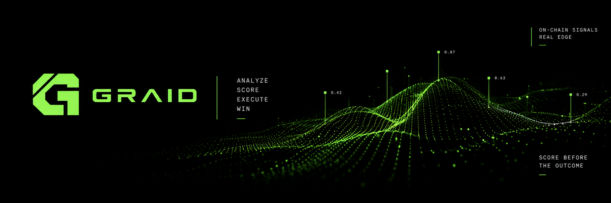
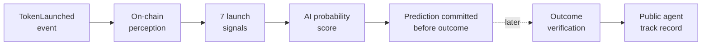

<p align="center">
  
</p>

<p align="center">
  <strong>An autonomous AI agent for real-time token launch intelligence.</strong>
</p>

<p align="center">
  It watches every launch on Robinhood Chain, predicts whether outside money will show up,<br>
  records the prediction before the outcome exists, and comes back later to score itself.
</p>

<p align="center">
  
  
  
  
  
  
</p>

<p align="center">
  <a href="https://graid-ai.com"><strong>graid-ai.com</strong></a>
</p>

---

## The agent

Thousands of tokens can launch in a single day. Most never attract meaningful demand, and only a small fraction fill their bonding curve and reach a real exchange.

GRAID is an always-on **predictive AI agent** built to identify that signal at launch time. It has already scored more than **110,000 live launches**. For each new `TokenLaunched` event, it gathers on-chain context, assigns a probability, and permanently records its call while the answer is still unknown.

Later, the agent revisits the curve, measures what actually happened, and adds the result to its public track record. Wins and misses are treated the same way. There is no wallet, no trade execution, and no hand-picked showcase.

> **Every launch. One prediction. Written before the outcome.**

## Why this is an AI agent

This is not a static dashboard and not a token-rating form. The software runs a complete autonomous decision loop:

1. **Observe** — detect every new launch from the factory event stream.
2. **Understand** — reconstruct creator behavior, deployer history, token configuration, and launch context from on-chain data.
3. **Predict** — use a fitted and calibrated statistical model to estimate the probability of real outside demand.
4. **Commit** — append the timestamped prediction and its evidence before the result is available.
5. **Verify** — return after the fixed observation window and independently measure the outcome.
6. **Evaluate** — continuously recompute AUC, Brier score, calibration, hit rate, and lift from its own public record.

The intelligence layer is a transparent probabilistic model rather than an LLM. AI agents do not need to be chatbots: this one perceives its environment, makes an autonomous decision, acts on that decision by publishing it, and evaluates itself against reality.

## What the agent predicts

The target is deliberately narrow and measurable:

> **Will outside money reach 10% of the migration threshold early in a token's life?**

Only qualifying buys count. The agent excludes money that is:

- part of the original launch transaction;
- sent by the deployer; or
- sent by a wallet declared exempt from the opening tax.

This prevents a creator's own launch buy from being presented as organic traction.

Every launch is scored over the same fixed observation window, measured from its own
launch block, so one launch is never given longer to succeed than another. The exact
rule, and why the window is fixed rather than open-ended, is in
[`docs/event.md`](docs/event.md).

**It does not predict price and does not tell users what to buy.** A token may attract outside demand and still lose value. The agent predicts only whether independent buyers show up during the defined window.

## The intelligence pipeline



The model measures seven features available when the launch appears:

| Signal | What it captures |
|---|---|
| Creator buy | How much of the supply the creator bought in the launch transaction |
| Deployer history | How many tokens the deployer launched during the rolling hour |
| Tax-exempt wallets | How many wallets received opening-tax exemptions |
| Social presence | Whether the token published social links |
| Creator fee | The configured creator tax |
| Fee destination | Whether fees are routed to the deployer or a third party |
| Pair type | Whether the curve is paired with ETH or a stock token |

The model combines empirical feature rates in log-odds space and applies Platt calibration against thousands of resolved live outcomes. The implementation is intentionally inspectable: see [`src/model.mjs`](src/model.mjs).

## Public track record

Snapshot from **2026-09-10**. The live record continues to grow, and the site reads
these figures from it directly rather than from this table.

| Metric | Result |
|---|---:|
| Predictions on record | 113,055 |
| Predictions resolved | 65,896 |
| Live AUC | **0.757** |
| Brier score | **0.161** |
| Base-rate Brier | 0.167 |
| Outside-money base rate | 21.3% |
| Top-decile hit rate | **43.1%** |

The held-out training check produced an AUC of **0.729**, with a range of 0.665–0.786 across four folds.

**These numbers went down, and the reason matters more than the numbers.**

Until 2026-09-06 the listener read a fixed window of the last 600 blocks. Any polling
cycle slower than a minute silently dropped every launch in between, and slow cycles
happen precisely during bursts. The agent was recording roughly one launch in ten, and
not a random one: it saw the quiet stretches and missed the busy ones.

With the bug fixed the agent sees the whole population, and measured against it the same
model scores worse — live AUC fell from 0.745 to 0.649 on predictions made after the fix.
The earlier figure was not skill. It was an easier sample.

On the corrected population the Brier score has moved **ahead of always guessing the base
rate** — 0.161 against 0.167 — and the ranking carries more signal than before, AUC 0.757
against 0.5 for a coin. The predictions recorded under the old regime were still overconfident,
because their calibration was fitted for an older base rate. The model now uses a fit from the
corrected population, validated on a later chronological holdout.

`npm run verify` keeps checking the immutable historical record; deploying a new model does
not rewrite old predictions to make that aggregate look better.

### Migration signal

Migration is not the primary prediction target, but the launch score is also tested against later graduation to a Uniswap pool.

In the recorded snapshot, launches scored above 65% reached a pool at approximately **2.8× the rate** of launches scored below 20%. The migration sample is much smaller than the traction sample, so this should be treated as supporting evidence rather than a promise.

## Check the numbers yourself

Nothing above has to be taken on trust. The raw logs are in `data/`, and the script
that recomputes every headline figure from them is in the repository:

```bash
npm install
npm test              # invariants the track record depends on
npm run verify        # recompute AUC, Brier, base rate and top-decile hit rate
npm run recalibrate   # fit recent outcomes, validate chronologically, update model.json
```

`verify.mjs` reads the committed prediction and outcome logs, recomputes the
metrics from scratch, and checks the one claim that cannot be reconstructed after
the fact: that every outcome is timestamped after the prediction it scores. It also
compares the AUC printed in this README against the data and complains if they have
drifted apart.

The same two commands run in CI on every push, so the check on this repository is
not a claim by the author but a result produced by a machine. The commit history is
the other half of the proof: GitHub stamps when each batch of predictions landed, so
a prediction cannot have been written after its outcome was known.

## Architecture

| Path | Responsibility |
|---|---|
| [`src/server.mjs`](src/server.mjs) | Autonomous event loop, prediction commits, resolution queue, API, and web server |
| [`src/chain.mjs`](src/chain.mjs) | Robinhood Chain reads, event decoding, transaction context, and curve activity |
| [`src/model.mjs`](src/model.mjs) | Feature buckets, model fitting, probability inference, and calibration |
| [`src/scoreboard.mjs`](src/scoreboard.mjs) | Live AUC, Brier score, calibration, top-decile performance, and verdict history |
| [`src/flags.mjs`](src/flags.mjs) | Human-readable explanations attached to launch scores |
| [`web/index.html`](web/index.html) | Public interface for the autonomous agent |
| [`scripts/verify.mjs`](scripts/verify.mjs) | Recomputes the published track record from the raw logs |
| [`test/`](test/) | Regression tests for the invariants the record depends on |
| [`analysis/`](analysis/) | Offline studies: holdout validation and migration follow-up |
| [`docs/`](docs/) | What is predicted, the model card, and how the agent is run |
| [`src/collect/`](src/collect/) | Samplers used to build the training windows |
| `data/*.jsonl.gz` | Append-only predictions and the outcomes measured after the window |

Each prediction records the model version, timestamp, token, deployer, launch block, probability, and the feature values used to produce it. Each resolution records the observed outside-money share and whether the event occurred.

## Run the agent

Requirements: **Node.js 20+** and access to the public Robinhood Chain RPC endpoints.

```bash
git clone https://github.com/0xfokki/graid.git
cd graid
npm install
npm start
```

Open [http://127.0.0.1:4664](http://127.0.0.1:4664).

To keep runtime records in a separate directory:

```bash
DATA_DIR=./data npm start
```

To rebuild `model.json` from the included training windows:

```bash
npm run model
```

## Agent API

The server exposes the same intelligence used by the web interface:

| Endpoint | Purpose |
|---|---|
| `/api/status` | Chain head, launch rate, uptime, and agent status |
| `/api/feed` | Live stream of newly scored launches |
| `/api/scoreboard` | Public performance and calibration metrics |
| `/api/verdicts` | Recently resolved predictions |
| `/api/graduated` | Scored launches that later reached a pool |
| `/api/predict` | Analyze a token by address; ticker lookup covers the collected set only |
| `/api/model` | Current model metadata and feature statistics |

## Trust model

The agent is designed to make hindsight manipulation difficult:

- predictions are written before the outcome exists;
- records are append-only JSONL rather than editable showcase entries;
- model versions and input features are stored with every prediction;
- the public scoreboard includes misses and calibration errors;
- anyone can inspect the scoring and resolution code;
- the agent never signs transactions and never touches a wallet.

## Limitations

- The initial feature-rate fit used a sample drawn from four time windows on a single day; the 110K+ figure refers to launches scored live, not the training-set size.
- It has limited evidence across major market-regime changes.
- Naive Bayes can double-count correlated signals and overstate confidence.
- The migration model is based on far fewer positive examples than the traction model.
- Tax-exempt wallets cannot be decoded for every custom launch contract.
- Public RPC rate limits may produce incomplete outcome reads; these are marked `complete: false`.
- A high score is evidence of relative launch potential, not a guarantee of demand, migration, or price appreciation.

## Built on

| Source | Used for |
|---|---|
| [Pons documentation](https://docs.ponsfamily.com/v2) | Factory contracts, launch events, curve mechanics, and migration rules |
| [Robinhood Chain documentation](https://docs.robinhood.com/chain/) | RPC access, chain ID 4663, and network behavior |
| Platt (1999); Niculescu-Mizil & Caruana (2005) | Probability calibration methodology |

This project is independent of Pons, Uniswap, and Robinhood and is not endorsed by them.

## License

MIT.
